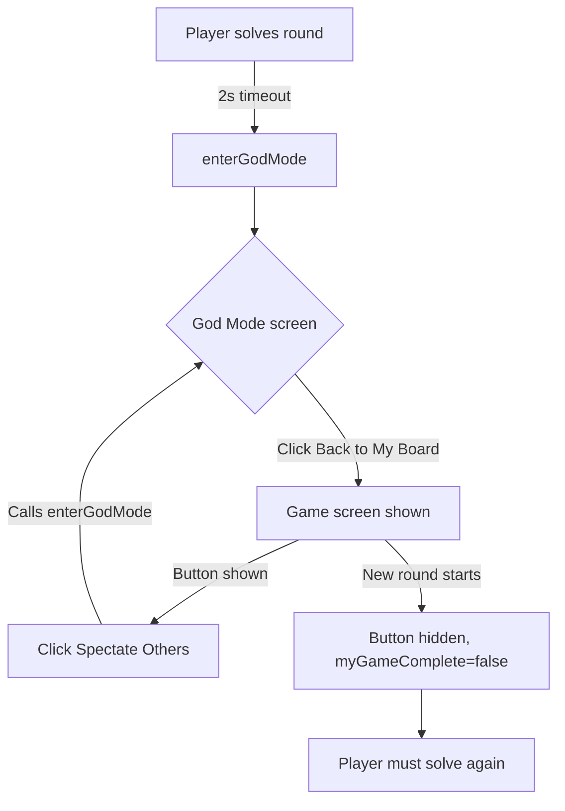

# Fix: God Mode Re-entry After "Back to My Board"

## Problem

When a player completes their round (solved or failed), they are automatically entered into **God Mode** (spectating other players). If they click **"Back to My Board"** to check their own solved board, they cannot return to spectating — there is no UI mechanism to re-enter God Mode until the **next round starts** (which resets `myGameComplete` to `false`).

## Root Cause

- [`enterGodMode()`](script.js:86) is only called automatically on solve/fail or on reconnect.
- The **"Back to My Board"** button handler (line 176) simply hides the God Mode screen and shows the game screen — it does not provide any way to return.
- `handleKey()` (line 122) guards against input when `roundSolved` is `true`, so the keyboard is effectively locked on the game screen.
- There is **no button or UI element** on the game screen that lets a completed player re-enter God Mode.

## Solution

### 1. Add a "Spectate Others" button to [`index.html`](index.html)

Insert a button in the game screen's top bar (`.top-bar-right` div) that is **hidden by default**:

```html
<button data-god-mode-reenter-btn class="small-btn hidden">👁️ Spectate Others</button>
```

**Placement**: In the `.top-bar-right` div (line 128-135), near the timer or leaderboard toggle.

### 2. Add JavaScript logic to [`script.js`](script.js)

#### a) Declare a reference to the new button (near line 10-20)

```js
const godModeReenterBtn = document.querySelector('[data-god-mode-reenter-btn]');
```

#### b) Create a helper to toggle button visibility

```js
function showGodModeReentryButton(show) {
  if (godModeReenterBtn) {
    godModeReenterBtn.classList.toggle('hidden', !show);
  }
}
```

#### c) Hide the button when entering God Mode

In [`enterGodMode()`](script.js:86) — the player is already in God Mode so no button needed:

```js
function enterGodMode(){
  if(!myGameComplete)return;
  showScreen('godMode');
  showGodModeReentryButton(false);   // <-- ADD
  // ... rest of function
}
```

#### d) Show the button when leaving God Mode

In the **"Back to My Board"** click handler (line 175-176):

```js
godModeBackBtn.addEventListener('click', () => {
  showScreen('game');
  document.querySelector('[data-game-main]').style.display = '';
  document.querySelector('[data-leaderboard]').style.display = '';
  showGodModeReentryButton(true);    // <-- ADD
});
```

#### e) Hide the button when a new round starts

In [`startRound()`](script.js:70) — `myGameComplete` becomes `false`:

```js
function startRound(d){
  gameState = 'playing';
  myGameComplete = false;
  roundSolved = false;
  showGodModeReentryButton(false);   // <-- ADD
  // ... rest of function
}
```

#### f) Hide the button when resetting to menu

In [`resetToMenu()`](script.js:152):

```js
function resetToMenu(){
  // ... existing code ...
  showGodModeReentryButton(false);   // <-- ADD
  // ... rest of function
}
```

#### g) Wire up the button click

Add an event listener to call `enterGodMode()`:

```js
if (godModeReenterBtn) {
  godModeReenterBtn.addEventListener('click', () => { enterGodMode(); });
}
```

### 3. Verify server-side compatibility

The server's [`requestSpectate` handler](server.js:951) calls [`sendSpectateInit()`](server.js:184), which checks [`canPlayerSpectate()`](server.js:155) — this verifies `player.solved === true`. Since the player already solved their round, this remains `true` until the round ends, so re-requesting spectate data will work correctly.

## Flow Diagram



## Files to Modify

| File | Changes |
|------|---------|
| [`index.html`](index.html) | Add `data-god-mode-reenter-btn` button in `.top-bar-right` |
| [`script.js`](script.js) | Add button reference, visibility toggle helper, and event wiring |

## Edge Cases Covered

1. **Player fails (out of attempts)** — Same flow as solve; `myGameComplete` is `true`, so the button reappears after leaving God Mode.
2. **Reconnect while in God Mode** — `handleReconnect()` already calls `enterGodMode()` on reconnect if `myGameComplete` is true.
3. **Round ends while player is on their board** — The round-end screen transition will handle this via server message; no action needed.
4. **All other players finish** — `renderSpectatePlayers` already shows an empty-state message. Button visibility is unrelated.
