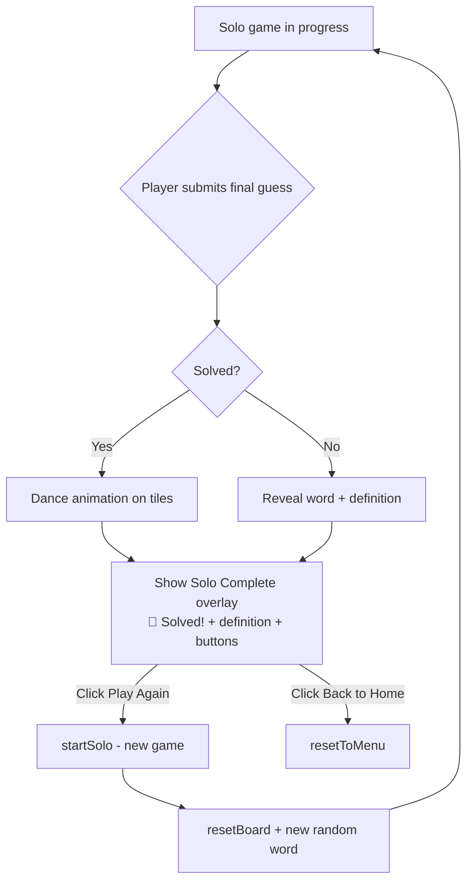

# Plan: Solo Mode — Completion UI with Definition + Play Again / Back to Home

## Problem

When a player solves (or fails) the word in solo mode, the current behavior is:
1. A transient `showAlert()` is shown with the word's definition embedded in the alert text (displayed ~5 seconds).
2. After that timeout, [`resetToMenu()`](script.js:194) is called automatically, returning the player to the main menu.

There is no way for the player to:
- Read the definition at their own pace
- Choose to play again immediately
- Choose to go back to the home screen when they're ready

## Key Locations

| File | Relevant Lines | Description |
|------|---------------|-------------|
| [`script.js`](script.js) | 173-192 | `handleSolo()` — handles solved and failed cases, currently calls `showAlert()` + `setTimeout(resetToMenu, 5000)` |
| [`script.js`](script.js) | 172 | `startSolo()` — initializes a new solo game |
| [`script.js`](script.js) | 194 | `resetToMenu()` — resets all state and shows main menu |
| [`script.js`](script.js) | 2 | `wordDefinitions` — global object containing definitions keyed by word |
| [`index.html`](index.html) | 249-261 | `game-end` screen — existing modal pattern to follow for the new UI |
| [`styles.css`](styles.css) | 828-938 | Existing `.game-end` + `.round-end` styles — patterns to follow |

## Proposed Solution

Replace the `showAlert()` + auto-redirect in [`handleSolo()`](script.js:173) with a **dedicated overlay/screen** (the "Solo Complete" screen) containing:

1. **Outcome header** — "🎉 Solved!" or "💔 Out of Attempts"
2. **Word display** — The target word in large, uppercase letters
3. **Definition** — Part of speech + definition from [`wordDefinitions`](script.js:2)
4. **"Play Again" button** — Calls [`startSolo()`](script.js:172) to immediately start a new solo game
5. **"Back to Home" button** — Calls [`resetToMenu()`](script.js:194) to return to main menu

### Design Pattern

The new screen follows the same modal overlay pattern as the existing [`round-end`](index.html:233-247) and [`game-end`](index.html:249-261) screens — a `position: fixed; inset: 0` overlay with centered content, styled consistently with the dark theme.

### Flow Diagram



## Implementation Steps

### Step 1: Add HTML for Solo Complete Screen in [`index.html`](index.html)

Insert **after** the `game-end` screen (after line 261) and **before** the closing `</body>` tag (line 262):

```html
<!-- Solo Complete Screen -->
<div data-solo-complete class="solo-complete hidden">
  <div class="solo-complete-content">
    <h2 data-solo-complete-title></h2>
    <div class="solo-word-reveal">
      The word was: <strong data-solo-word></strong>
    </div>
    <div class="word-definition" data-solo-word-definition></div>
    <div class="solo-complete-buttons">
      <button data-solo-play-again class="menu-btn primary">Play Again</button>
      <button data-solo-back-home class="menu-btn">Back to Home</button>
    </div>
  </div>
</div>
```

### Step 2: Add CSS in [`styles.css`](styles.css)

Add styles for the `.solo-complete` overlay and its children. Follow the same aesthetic as `.round-end` and `.game-end`:

```css
/* ===== SOLO COMPLETE ===== */
.solo-complete {
  position: fixed;
  inset: 0;
  background: rgba(0, 0, 0, 0.9);
  display: flex;
  align-items: center;
  justify-content: center;
  z-index: 70;
  color: white;
}

.solo-complete-content {
  text-align: center;
  max-width: 500px;
  padding: 2em;
}

.solo-complete-content h2 {
  font-size: 2em;
  margin: 0 0 0.5em 0;
}

.solo-word-reveal {
  font-size: 1.3em;
  margin: 0.5em 0 1em 0;
}

.solo-word-reveal strong {
  color: hsl(115, 29%, 53%);
  font-size: 1.2em;
  letter-spacing: 3px;
  text-transform: uppercase;
}

.solo-complete-buttons {
  display: flex;
  gap: 0.8em;
  justify-content: center;
  margin-top: 1.5em;
}

.solo-complete-buttons .menu-btn {
  min-width: 140px;
  font-size: 1.1em;
}
```

**Note:** The `.word-definition` class already exists in [`styles.css`](styles.css:1318-1333), so we can reuse it via the `data-solo-word-definition` element.

### Step 3: Add JavaScript Changes in [`script.js`](script.js)

#### 3a — Add DOM reference and a helper function

Near the other DOM references (after line 21), add:

```js
const soloCompleteScreen = document.querySelector('[data-solo-complete]');
const soloCompleteTitle = document.querySelector('[data-solo-complete-title]');
const soloWordEl = document.querySelector('[data-solo-word]');
const soloWordDefEl = document.querySelector('[data-solo-word-definition]');
```

#### 3b — Create `showSoloComplete()` function

Add a new function (could go after `resetBoard()` or near `handleSolo()`):

```js
function showSoloComplete(solved, word, definition) {
  gameState = 'soloComplete';
  // Set title
  soloCompleteTitle.textContent = solved ? '🎉 Solved!' : '💔 Out of Attempts';
  // Set word
  soloWordEl.textContent = word.toUpperCase();
  // Set definition
  if (definition && definition.found && definition.definition) {
    soloWordDefEl.innerHTML =
      '<em>' + esc(definition.partOfSpeech || 'word') + ':</em> ' + esc(definition.definition);
  } else {
    soloWordDefEl.innerHTML = '<em>No definition available for this word yet.</em>';
  }
  showScreen('soloComplete');
}
```

#### 3c — Modify [`handleSolo()`](script.js:173) solved case

Replace lines 173-181 (the solved block) with:

```js
if (solved) {
  roundSolved = true;
  // Dance animation
  for (let i = 0; i < WL; i++) {
    const t = guessGrid.children[currentRow * WL + i];
    setTimeout(() => {
      t.classList.add('dance');
      t.addEventListener('animationend', () => t.classList.remove('dance'), { once: true });
    }, i * 100);
  }
  // Show solo complete UI after dance animation completes
  setTimeout(() => {
    showSoloComplete(true, soloTargetWord, wordDefinitions[soloTargetWord] || null);
  }, 600);
}
```

#### 3d — Modify [`handleSolo()`](script.js:182) failed case

Replace lines 182-192 (the failed block) with:

```js
else if (currentRow >= WR - 1) {
  roundSolved = true;
  showSoloComplete(false, soloTargetWord, wordDefinitions[soloTargetWord] || null);
}
```

#### 3e — Add event listeners for the new buttons

Near the other event bindings (after line 235), add:

```js
// Solo Complete buttons
document.querySelector('[data-solo-play-again]').addEventListener('click', () => {
  startSolo();
});
document.querySelector('[data-solo-back-home]').addEventListener('click', () => {
  resetToMenu();
});
```

#### 3f — Add `soloComplete` to `showScreen()` mapping

Update the `showScreen()` function (line 61) to include the new screen:

```js
function showScreen(sc) {
  const m = {
    menu: mainMenu,
    createRoom: createRoomModal,
    joinRoom: joinRoomModal,
    lobby,
    game: gameScreen,
    godMode: godModeScreen,
    roundEnd: roundEndScreen,
    gameEnd: gameEndScreen,
    soloComplete: soloCompleteScreen,  // ADD THIS
  };
  // ... rest stays the same
}
```

#### 3g — Ensure `startSolo()` resets state properly

Verify that [`startSolo()`](script.js:172) already resets `gameState` to `'playing'` and calls `resetBoard()` — it does, so no changes needed.

#### 3h — Ensure `resetToMenu()` handles the new screen

Check that `resetToMenu()` calls `showScreen('menu')` which will correctly hide the solo-complete screen (since `showScreen()` hides all screens first via `Object.values(m).forEach(s => s && s.classList.add('hidden'))`). No changes needed.

## Files to Modify

| File | Changes |
|------|---------|
| [`index.html`](index.html) | Add `<div data-solo-complete>` overlay after the game-end screen |
| [`styles.css`](styles.css) | Add `.solo-complete`, `.solo-complete-content`, `.solo-word-reveal`, `.solo-complete-buttons` styles |
| [`script.js`](script.js) | Add DOM references, `showSoloComplete()` function, modify `handleSolo()`, add event listeners, update `showScreen()` mapping |

## Edge Cases Covered

1. **Definition not found** — Falls back to "No definition available for this word yet." (same as existing round-end behavior).
2. **Player fails (out of attempts)** — Shows "💔 Out of Attempts" header, the word they failed to solve, and its definition.
3. **Pressing physical/keyboard keys during solo-complete screen** — The `gameState` check in [`handleKey()`](script.js:141) guards against input when `gameState !== 'playing'`, so no extra guard needed.
4. **Starting a new game (Play Again)** — `startSolo()` resets the board, picks a new random word, and sets `gameState = 'playing'`.
5. **Dance animation interfering with overlay** — The 600ms delay ensures dance animation completes before showing the overlay.
6. **Existing multiplayer screens unaffected** — SoloComplete is a new screen key; multiplayer uses `roundEnd`, `gameEnd`, `godMode` screens which remain unchanged.
