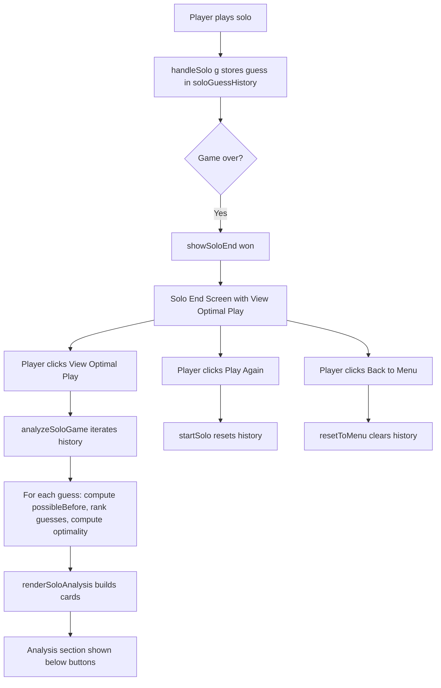
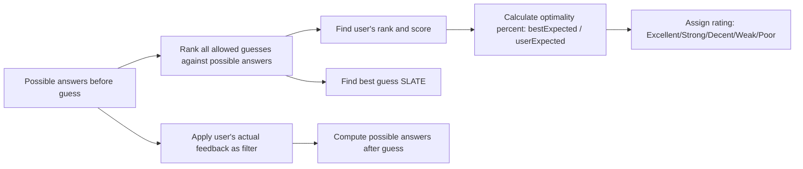

# Solo Mode Optimal Guess Review — Implementation Plan

## Overview

Add a post-game review screen for solo mode where players can analyze how optimal their guesses were. After solving or failing, they can click "View Optimal Play" to see detailed stats per guess.

---

## Implementation Phases

### Phase 1: Replace [`index.html`](index.html) Solo Complete Screen with Solo End Screen

**Current state:** Lines 263-276 have a [`data-solo-complete`](index.html:263) screen with "Play Again" and "Back to Home" buttons.

**Replace with** a new [`data-solo-end`](index.html:~264) screen containing:
- Title (`[data-solo-end-title]`) — "Solved in N guesses!" or "Out of guesses!"
- Word reveal (`[data-solo-word]`) — reuses existing element
- Word definition (`[data-solo-word-definition]`) — reuses existing element
- Summary text (`[data-solo-summary]`) — contextual message
- Action buttons:
  - **View Optimal Play** (`[data-view-optimal-play-btn]`) — triggers analysis
  - **Play Again** (`[data-solo-play-again-btn]`) — starts new solo game
  - **Back to Menu** (`[data-solo-back-menu-btn]`) — returns to main menu
- Analysis section (`[data-solo-analysis]`, initially hidden) containing:
  - `[data-solo-analysis-list]` — populated dynamically with guess cards

**Key change:** The old screen ID `soloComplete` and `soloCompleteScreen` reference is removed. The word/definition elements (`data-solo-word`, `data-solo-word-definition`) stay the same since they're also used in the solo-end screen.

---

### Phase 2: Add Solo State Variables in [`script.js`](script.js)

Add near line 28-30 where existing state is declared:

```js
let soloGuessHistory = [];
let soloAnalysisCache = null;
const SOLO_ANALYSIS_MODE = 'answers-only';   // or 'all-valid-guesses'
const SOLO_ANALYSIS_TOP_N = 5;
```

`soloGuessHistory` stores each guess as:
```js
{ guess: 'adieu', feedback: [...], attemptNumber: 1, solved: false }
```

`soloAnalysisCache` caches analysis results so clicking "View Optimal Play" again doesn't recompute.

---

### Phase 3: Update [`startSolo()`](script.js:176) and [`handleSolo(g)`](script.js:177)

**In `startSolo()`** — Add after `soloTargetWord = ...`:
```js
soloGuessHistory = [];
soloAnalysisCache = null;
```

**In `handleSolo(g)`** — After calculating feedback, push to history:
```js
soloGuessHistory.push({
  guess: g,
  feedback: fb,
  attemptNumber: currentRow + 1,
  solved,
});
```

Then replace the calls to `showSoloComplete()` with calls to `showSoloEnd()`:
- On solved: `showSoloEnd(true)` (after dance animation timeout)
- On fail: `showSoloEnd(false)`

---

### Phase 4: Update [`showScreen(sc)`](script.js:65)

Add `soloEnd: soloEndScreen` to the screen map object and add a query selector for the new `[data-solo-end]` element.

---

### Phase 5: Update [`resetToMenu()`](script.js:196)

Add these lines to clear solo analysis state:
```js
soloGuessHistory = [];
soloAnalysisCache = null;
```

---

### Phase 6: Add `showSoloEnd()` and `renderSoloDefinition()`

**`showSoloEnd(won)`** — New function that:
1. Sets `gameState = 'soloEnd'`
2. Populates title, word, definition, and summary
3. Hides the analysis section
4. Calls `showScreen('soloEnd')`

**`renderSoloDefinition(definition)`** — Targets `[data-solo-word-definition]` instead of `[data-word-definition]`. Same logic as existing [`renderDefinition()`](script.js:197).

---

### Phase 7: Build Analysis Engine

All new functions in [`script.js`](script.js):

| Function | Purpose |
|---|---|
| `feedbackToPattern(feedback)` | Convert feedback array to pipe-delimited string key |
| `filterPossibleAnswers(possibleAnswers, guess, feedback)` | Keep answers that would produce the same feedback |
| `scoreGuessByExpectedRemaining(guess, possibleAnswers)` | Score a guess by how well it splits possibilities |
| `getAllowedAnalysisGuesses()` | Returns either `targetWords` only or `dictionary + targetWords` based on `SOLO_ANALYSIS_MODE` |
| `rankOptimalGuesses(possibleAnswers, allowedGuesses)` | Rank all guesses by expected remaining (lower = better) |
| `calculateOptimalityPercent(bestExpected, userExpected)` | 0-100% score comparing user's guess to best |
| `getOptimalityRating(percent)` | Map percentage to label: Excellent ≥95, Strong ≥85, Decent ≥70, Weak ≥50, Poor <50 |

**Performance shortcut:** If `possibleAnswers.length === 1`, return immediately with the single answer as the optimal guess.

---

### Phase 8: Add `analyzeSoloGame()` and `renderSoloAnalysis()`

**`analyzeSoloGame()`** — Main orchestrator that:
1. Uses cached result if available
2. Iterates through `soloGuessHistory`
3. For each guess: calculates possible before/after, ranks guesses, computes optimality
4. Returns review array with all stats per guess

**`renderSoloAnalysis()`** — Renders analysis cards:
1. Calls `analyzeSoloGame()`
2. Creates one card per guess with: guess word, rating badge, rank, best word, possible before/after counts, expected remaining comparison, top 5 suggestions (collapsible)
3. Shows the analysis section

---

### Phase 9: Event Bindings

Add after existing event bindings (around line 238-240):

```js
document.querySelector('[data-view-optimal-play-btn]')?.addEventListener('click', renderSoloAnalysis);
document.querySelector('[data-solo-play-again-btn]')?.addEventListener('click', startSolo);
document.querySelector('[data-solo-back-menu-btn]')?.addEventListener('click', resetToMenu);
```

---

### Phase 10: CSS Styles ([`styles.css`](styles.css))

Add after existing `.solo-complete` section (line 1422):

- `.solo-end` — Full-screen overlay layout (similar to existing `.solo-complete`)
- `.solo-end-content` — Content container with max-width
- `.solo-end-actions` — Flex row for buttons
- `.solo-analysis` — Top margin container
- `.solo-analysis-card` — Card per guess with rounded corners and border-left rating color
- `.solo-analysis-header` — Flex row with guess number, word, rating
- `.solo-guess` — Large bold guess word
- `.solo-analysis-grid` — CSS grid of stat items
- `.solo-top-suggestions` — Collapsible `<details>` for top 5
- Rating classes: `.rating-excellent` (green), `.rating-strong` (teal), `.rating-decent` (yellow), `.rating-weak` (orange), `.rating-poor` (red)

---

### Phase 11: Edge Cases

1. **Empty word lists** — Hide "View Optimal Play" button or show "Analysis unavailable" if `targetWords` or `dictionary` is empty
2. **Single answer remaining** — Short-circuit in `rankOptimalGuesses()` to return just that answer
3. **Solved guess** — The last guess shows "Solved" rating at 100% optimal, `possibleAfter: 1`
4. **Dictionary-only guess** — If user's guess is not in `targetWords` (only in `dictionary`), score it manually and show rank as "Dictionary guess — not in answers-only ranking"

---

## Files Modified

| File | Changes |
|---|---|
| [`index.html`](index.html) | Replace `data-solo-complete` screen with `data-solo-end` screen |
| [`script.js`](script.js) | ~12 new functions, ~5 modified functions, ~3 new event bindings, ~2 new state vars |
| [`styles.css`](styles.css) | ~60 lines of new CSS for solo-end screen and analysis cards |

---

## Data Flow Diagram



---

## Guess Analysis Flow (per guess)



---

## Recommended Implementation Order

The phases should be implemented in order 1→11, as each builds on the previous. The analysis engine (Phase 7) is the most complex and should be tested carefully. Start with `SOLO_ANALYSIS_MODE = 'answers-only'` for performance — this limits guess ranking to only the ~2,315 target words, which is fast enough for UI thread.

If performance is acceptable, upgrade to `'all-valid-guesses'` later. If not, consider a Web Worker.
