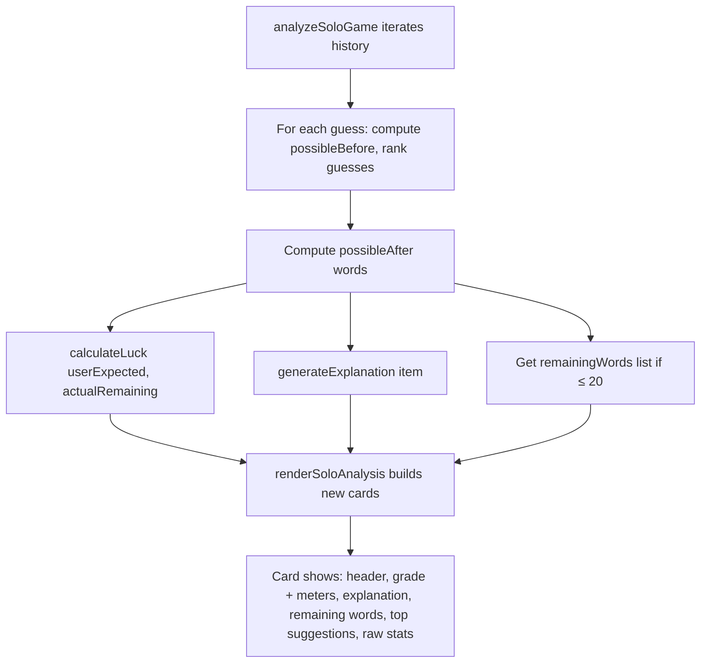

# Plan: User-Friendly Guess Analysis Redesign

## Problem

The current [`renderSoloAnalysis()`](script.js:335-377) function produces analysis cards that display raw statistics like "Expected Remaining: 11.6" and "Your Rank: #669 / 2315". While technically accurate, this is overwhelming for casual players and feels like a math test rather than a fun post-game review.

## Goal

Redesign the analysis cards to be **intuitive, engaging, and actionable** — focusing on the "why" behind each guess with plain English explanations, visual grades, and concrete details like the actual list of remaining words.

---

## Part 1: Updated Grade Categories

Replace the old 5-tier percentage-based system with **4 intuitive categories** that map to clear emotional outcomes:

| Old Rating | Old Threshold | New Grade | Emoji | Border Color |
|---|---|---|---|---|
| Excellent (≥95%) | required both high skill | 🌟 Brilliant | 🌟 | `#22c55e` (green) |
| Strong (≥85%) | solid strategic play | ✅ Solid | ✅ | `#14b8a6` (teal) |
| Decent (≥70%) | acceptable but suboptimal | ⚠️ Risky | ⚠️ | `#eab308` (yellow) |
| Weak (≥50%) | poor strategic choice | ❌ Wasted | ❌ | `#ef4444` (red) |
| Poor (<50%) | very suboptimal | ❌ Wasted | ❌ | `#ef4444` (red) |

**Key changes:**
- Collapse "Weak" and "Poor" into "❌ Wasted Guess"
- Rename "Excellent" → "🌟 Brilliant" (more fun)
- Rename "Strong" → "✅ Solid" (more relatable)
- Rename "Decent" → "⚠️ Risky" (frames it as a trade-off)
- Remove the percentage display from the card header (show it in a tooltip or small text instead)

**New mapping function** — replace [`getOptimalityRating()`](script.js:287-293):

```js
function getOptimalityRating(percent) {
  if (percent >= 95) return { label: 'Brilliant', emoji: '🌟', cssClass: 'brilliant' };
  if (percent >= 85) return { label: 'Solid', emoji: '✅', cssClass: 'solid' };
  if (percent >= 70) return { label: 'Risky', emoji: '⚠️', cssClass: 'risky' };
  return { label: 'Wasted', emoji: '❌', cssClass: 'wasted' };
}
```

---

## Part 2: Skill vs. Luck Meter

Add a dual-meter display for each guess that separates **skill** (how good your guess was given the information) from **luck** (how much better your actual outcome was than expected).

### Skill Calculation (already exists)
- `optimalityPercent` — already calculated in [`analyzeSoloGame()`](script.js:295-333)

### Luck Calculation (new)
Luck measures the gap between **expected remaining** (what the math predicted) and **actual remaining** (what happened after your guess):

```js
function calculateLuck(userExpectedRemaining, actualRemaining) {
  // If actual is much smaller than expected, you got lucky
  // If actual is much larger than expected, you got unlucky
  if (actualRemaining === 0) actualRemaining = 1; // solved case
  const ratio = actualRemaining / userExpectedRemaining;
  if (ratio <= 0.3) return { label: '🍀 Lucky', percent: 95, color: '#22c55e' };
  if (ratio <= 0.7) return { label: '🍀 Somewhat Lucky', percent: 75, color: '#86efac' };
  if (ratio <= 1.3) return { label: '➡️ Expected', percent: 50, color: '#9ca3af' };
  if (ratio <= 2.0) return { label: '😬 Unlucky', percent: 25, color: '#f97316' };
  return { label: '💀 Very Unlucky', percent: 5, color: '#ef4444' };
}
```

### Visual Meter Bars

Render two compact progress bars side by side:

```
  SKILL          LUCK
[████████░░]   [████░░░░░░]
  85% Solid     40% Somewhat Lucky
```

---

## Part 3: Remaining Words List (Concrete Details)

Add an interactive, expandable "Remaining words" section to each card.

### Always show:
- "Possible words before: N" (simple text)
- "Possible words after: N" (simple text)

### If `possibleAfter` is small (≤ 20):
Show the actual list inline in a small expandable `<details>` element.

### If `possibleAfter === 1` (solved or one word left):
Explicitly say **"The only word left was `SMALL`."** — This is the most engaging insight you can give a player.

### If `possibleAfter === 0` (impossible guess that eliminated the answer):
Show warning: "⚠️ Your guess eliminated all possible answers — this shouldn't happen!"

### Implementation:

Add to the analysis data in [`analyzeSoloGame()`](script.js:295-333):

```js
// After calculating possibleAfter
const remainingWords = possibleAfter.length <= 20
  ? possibleAfter.map(a => a.toUpperCase())
  : [];
```

Then in the card render, add:

```html
<div class="solo-remaining-words">
  Words before: <strong>${item.possibleBefore}</strong> → Words after: <strong>${item.possibleAfter}</strong>
  ${item.possibleAfter === 1
    ? `<p class="solo-only-word">✨ The only word left was <strong>${item.remainingWords[0]}</strong></p>`
    : item.remainingWords.length > 0
      ? `<details><summary>See the ${item.possibleAfter} words</summary>
         <div class="solo-word-list">${item.remainingWords.map(w => `<span class="solo-word-chip">${w}</span>`).join('')}</div></details>`
      : ''}
</div>
```

---

## Part 4: Plain English Explanations

Add a human-readable "why" for each guess. This is the most important UX improvement.

### Logic for explanations:

```js
function generateExplanation(item, possibleAnswersCount) {
  const { guess, optimalityPercent, rating, bestGuess, userRank, totalRanked, possibleBefore, possibleAfter, bestExpectedRemaining, userExpectedRemaining } = item;
  
  if (item.solved && item.attemptNumber === 1) {
    return "Incredible — you solved it on the first try! That's either a brilliant guess or incredible luck (or both).";
  }
  if (item.solved && possibleAfter === 1) {
    return `You solved it! The word was ${guess.toUpperCase()}.`;
  }
  
  const rankFraction = `${userRank}/${totalRanked}`;
  
  if (optimalityPercent >= 95) {
    const eliminated = possibleBefore - possibleAfter;
    return `${guess.toUpperCase()} was an excellent choice. It ranked #${rankFraction} among all possible guesses and eliminated ${eliminated} possible answers. ${bestGuess.toUpperCase()} was the mathematically optimal word, but yours was nearly as good.`;
  }
  if (optimalityPercent >= 85) {
    const diff = Math.round(bestExpectedRemaining - userExpectedRemaining);
    return `${guess.toUpperCase()} was a solid guess (ranked #${rankFraction}). The best word ${bestGuess.toUpperCase()} would have left about ${bestExpectedRemaining.toFixed(1)} words on average vs. ${userExpectedRemaining.toFixed(1)} for your guess — a difference of ${diff}.`;
  }
  if (optimalityPercent >= 70) {
    const betterCount = Math.max(0, userRank - 1);
    return `${guess.toUpperCase()} was a risky choice (ranked #${rankFraction}). There ${betterCount === 1 ? 'was 1 word' : `were ${betterCount} words`} that would have been better. The optimal word was ${bestGuess.toUpperCase()}, which would have narrowed it down to ~${bestExpectedRemaining.toFixed(1)} words on average.`;
  }
  // Wasted
  const betterCount = Math.max(0, userRank - 1);
  const pctEliminated = ((possibleBefore - possibleAfter) / possibleBefore * 100).toFixed(0);
  return `${guess.toUpperCase()} was not an efficient guess (ranked #${rankFraction} of ${totalRanked}). It only eliminated ${pctEliminated}% of possible answers. The best word ${bestGuess.toUpperCase()} would have left ~${bestExpectedRemaining.toFixed(1)} words on average vs. ${userExpectedRemaining.toFixed(1)} for your guess.`;
}
```

**The explanation replaces the grid of stat boxes.** Instead of showing 6 stat boxes, show 1-2 sentences that give the same information in plain English. The raw stats are still available in a collapsible `<details>` section for power users.

---

## Part 5: Updated Card Layout

The new card design per guess:

```
┌──────────────────────────────────────────────────┐
│  Guess 2     │  BOARD     │  ⚠️ Risky            │
│              │            │  Skill: ████░░ 68%   │
│              │            │  Luck:  ██████░ 72%  │
├──────────────────────────────────────────────────┤
│                                                   │
│  BOARD was a risky choice (ranked #41/2315).      │
│  There were 40 words that would have been better. │
│  The optimal word was COAST, which would have     │
│  narrowed it down to ~11.6 words on average.      │
│                                                   │
│  Words: 284 before → 61 after                     │
│  [▼ See the 61 words]                            │
│                                                   │
│  [▼ Top suggestions]                              │
│  1. COAST — average 11.6 left                     │
│  2. ROAST — average 11.9 left                     │
│  3. CAROL — average 12.1 left                     │
│  4. STALE — average 12.4 left                     │
│  5. SLANT — average 12.8 left                     │
│                                                   │
│  [▼ Raw stats] (for power users)                  │
│  Expected remaining: 16.3                         │
│  Best expected: 11.6                              │
│  Worst case: 33                                   │
│  Buckets: 42                                      │
│                                                   │
└──────────────────────────────────────────────────┘
```

---

## Part 6: "The Only Word Was X" Special Case

When `possibleAfter === 1` and the user didn't solve it yet (i.e., they had exactly one word left after their guess), the card should prominently display:

```html
<div class="solo-only-word-section">
  <span class="solo-only-word-icon">🎯</span>
  <div>
    <strong>Only one word could follow:</strong>
    <span class="solo-only-word">${remainingWord}</span>
  </div>
</div>
```

This applies when a guess narrows the possibilities to a single word (even if the player didn't guess it yet).

---

## Part 7: CSS Additions (`styles.css`)

Add after the existing `.solo-analysis-card` styles (line 1591):

```css
/* ===== SOLO ANALYSIS REDESIGN ===== */

/* Skill/Luck meters */
.solo-meters {
  display: flex;
  gap: 16px;
  margin: 8px 0;
}
.solo-meter {
  flex: 1;
}
.solo-meter-label {
  font-size: 0.75rem;
  opacity: 0.6;
  margin-bottom: 2px;
}
.solo-meter-bar {
  height: 6px;
  border-radius: 3px;
  background: rgba(255,255,255,0.1);
  overflow: hidden;
}
.solo-meter-fill {
  height: 100%;
  border-radius: 3px;
  transition: width 0.5s ease;
}
.solo-meter-value {
  font-size: 0.75rem;
  font-weight: 600;
  margin-top: 2px;
}

/* Explanation text */
.solo-explanation {
  font-size: 0.9rem;
  line-height: 1.5;
  color: hsl(0, 0%, 80%);
  margin: 12px 0;
  padding: 12px;
  background: rgba(255,255,255,0.03);
  border-radius: 8px;
}

/* Remaining words */
.solo-remaining-words {
  font-size: 0.85rem;
  margin: 8px 0;
  color: hsl(0, 0%, 70%);
}
.solo-remaining-words strong {
  color: white;
}
.solo-word-list {
  display: flex;
  flex-wrap: wrap;
  gap: 4px;
  margin-top: 6px;
}
.solo-word-chip {
  background: rgba(255,255,255,0.08);
  padding: 2px 8px;
  border-radius: 4px;
  font-size: 0.8rem;
  font-weight: 600;
  letter-spacing: 0.05em;
}

/* Only word section */
.solo-only-word-section {
  display: flex;
  align-items: center;
  gap: 8px;
  margin: 8px 0;
  padding: 10px 14px;
  background: rgba(34, 197, 94, 0.1);
  border: 1px solid rgba(34, 197, 94, 0.3);
  border-radius: 8px;
}
.solo-only-word-icon {
  font-size: 1.3rem;
}
.solo-only-word-section strong {
  display: block;
  font-size: 0.8rem;
  opacity: 0.7;
}
.solo-only-word {
  font-size: 1.2rem;
  font-weight: 800;
  color: #22c55e;
  letter-spacing: 0.1em;
}

/* Raw stats collapsible (for power users) */
.solo-raw-stats {
  margin-top: 8px;
}
.solo-raw-stats summary {
  cursor: pointer;
  font-size: 0.8rem;
  opacity: 0.5;
}
.solo-raw-stats summary:hover {
  opacity: 0.8;
}
.solo-raw-stats-grid {
  display: grid;
  grid-template-columns: repeat(auto-fit, minmax(120px, 1fr));
  gap: 6px;
  margin-top: 8px;
}
.solo-raw-stats-grid div {
  padding: 6px 8px;
  background: rgba(255,255,255,0.04);
  border-radius: 6px;
}
.solo-raw-stats-grid strong {
  display: block;
  font-size: 0.7rem;
  opacity: 0.6;
}
.solo-raw-stats-grid span {
  font-size: 0.85rem;
  font-weight: 600;
}

/* Rating border colors - updated */
.solo-analysis-card.rating-brilliant {
  border-left: 5px solid #22c55e;
}
.solo-analysis-card.rating-solid {
  border-left: 5px solid #14b8a6;
}
.solo-analysis-card.rating-risky {
  border-left: 5px solid #eab308;
}
.solo-analysis-card.rating-wasted {
  border-left: 5px solid #ef4444;
}

/* Top suggestions - keep existing but minor polish */
.solo-top-suggestions {
  margin-top: 8px;
}
.solo-top-suggestions summary {
  cursor: pointer;
  font-size: 0.85rem;
  opacity: 0.7;
}
.solo-top-suggestions ol {
  margin-top: 6px;
  padding-left: 20px;
}
.solo-top-suggestions li {
  margin-bottom: 3px;
  font-size: 0.85rem;
}

/* Card header - ensure guess word is prominent */
.solo-analysis-header .solo-guess {
  font-size: 1.5rem;
}
```

---

## Part 8: JavaScript Changes (`script.js`)

### 8a — New functions to add

1. **`calculateLuck(userExpectedRemaining, actualRemaining)`** — Returns luck label/percent/color
2. **`generateExplanation(item)`** — Returns plain English explanation string
3. **`getRemainingWordsList(possibleAnswers, maxCount = 20)`** — Returns array of words if ≤ maxCount

### 8b — Modify [`renderSoloAnalysis()`](script.js:335-377)

Complete rewrite of the card rendering to use the new layout. The function will:

1. For each review item, create the new card structure
2. Add skill/luck meters
3. Add plain English explanation
4. Add remaining words section (with special case for single word)
5. Add raw stats collapsible for power users
6. Update rating classes to new names

### 8c — Modify [`analyzeSoloGame()`](script.js:295-333)

Add to each review item:
- `luckData` — result of `calculateLuck()`
- `explanation` — result of `generateExplanation()`
- `remainingWords` — array of actual remaining word strings (if ≤ 20)

### 8d — Modify [`getOptimalityRating()`](script.js:287-293)

Return object with `{ label, emoji, cssClass }` instead of just a string.

---

## Part 9: Modified Data Flow



---

## Edge Cases

1. **First-guess solve** — Special explanation: "Incredible — you solved it on the first try!"
2. **Dictionary-only guess (not in targetWords)** — Show "Custom word — not in answer list ranking" in explanation
3. **`possibleAfter === 0`** — Show warning that guess eliminated all possibilities (shouldn't happen with valid words)
4. **Large remaining words list (>20)** — Don't show inline list; just show count with "Words: X → Y"
5. **Very early guesses (before/after 2000+)** — Don't try to show 2000 words; cap at 20
6. **Solved guess** — Don't show remaining words section; show "You solved it!" instead

---

## Files Modified

| File | Changes |
|---|---|
| [`script.js`](script.js) | Replace `getOptimalityRating()` return format; add `calculateLuck()`, `generateExplanation()`, `getRemainingWordsList()`; rewrite `renderSoloAnalysis()`; add `luckData`, `explanation`, `remainingWords` to analysis data |
| [`styles.css`](styles.css) | Add ~120 lines of new CSS for meters, explanations, word chips, only-word section, raw stats collapsible |
| (No HTML changes) | The `data-solo-analysis-list` container stays the same; all changes are in JS rendering |

---

## Implementation Order

1. Update `getOptimalityRating()` to return object with `{ label, emoji, cssClass }`
2. Add `calculateLuck()`, `generateExplanation()`, `getRemainingWordsList()` helper functions
3. Update `analyzeSoloGame()` to enrich review data with luck/explanation/remaining words
4. Rewrite `renderSoloAnalysis()` with new card template
5. Add all new CSS styles
6. Test with various game scenarios (solved, failed, lucky, unlucky)
